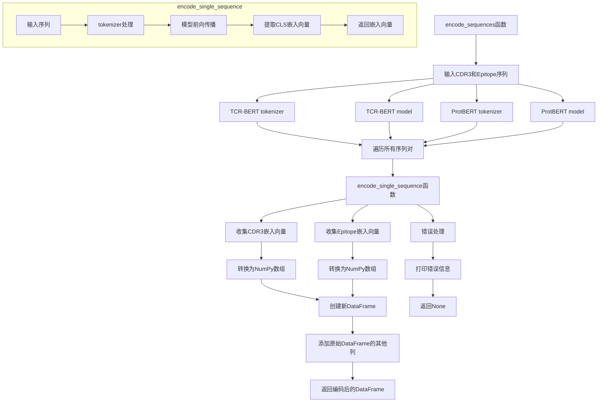

graph TD
    %% 数据输入和预处理
    A[输入数据] --> B[数据加载]
    B --> C[序列编码]
    
    %% 序列编码过程
    subgraph 序列编码过程
        C1[CDR3序列] --> D1[TCR-BERT编码]
        C2[Epitope序列] --> D2[ProtBERT编码]
        D1 --> E1[获取CLS嵌入向量]
        D2 --> E2[获取CLS嵌入向量]
    end
    
    %% 模型架构
    subgraph TEIM模型
        %% 特征提取
        F1[CDR3嵌入向量] --> G1[旋转位置编码RoPE]
        F2[Epitope嵌入向量] --> G2[旋转位置编码RoPE]
        
        G1 --> H1[序列特征提取CNN]
        G2 --> H2[序列特征提取CNN]
        
        %% 交互映射
        H1 --> I[交互映射矩阵]
        H2 --> I
        
        %% 残差网络层
        I --> J[残差网络层]
        J --> K[多层残差网络处理]
        
        %% 输出层
        K --> L1[序列级输出层]
        K --> L2[残差级输出层]
        
        L1 --> M1[结合预测概率]
        L2 --> M2[结合位点预测]
    end
    
    %% 训练过程
    subgraph 训练过程
        N[数据集划分] --> O[训练集]
        N --> P[验证集]
        
        O --> Q[批次训练]
        Q --> R[损失计算]
        R --> S[反向传播]
        S --> T[参数更新]
        T --> Q
        
        P --> U[模型评估]
        U --> V[AUC计算]
    end
    
    %% 模型保存和应用
    W[模型保存] --> X[模型应用]
    
    %% 连接各个部分
    E1 --> F1
    E2 --> F2
    M1 --> W
    M2 --> W
    V --> W

## 序列编码过程详细流程图



## TEIM模型结构和前向传播流程图

```mermaid
graph TD
    %% 模型初始化
    A[TEIM模型初始化] --> B[加载数据文件]
    B --> C1[初始化TCR-BERT]
    B --> C2[初始化ProtBERT]
    
    %% 模型组件初始化
    C1 --> D1[初始化旋转位置编码]
    C2 --> D1
    D1 --> D2[初始化序列特征提取模块]
    D2 --> D3[初始化交互层]
    D3 --> D4[初始化输出层]
    
    %% 前向传播过程
    E[前向传播] --> F[序列编码]
    F --> G1[提取CDR3嵌入向量]
    F --> G2[提取Epitope嵌入向量]
    
    %% 维度调整
    G1 --> H1[调整CDR3维度]
    G2 --> H2[调整Epitope维度]
    
    %% 应用旋转位置编码
    H1 --> I1[应用CDR3旋转位置编码]
    H2 --> I2[应用Epitope旋转位置编码]
    
    %% 序列特征提取
    I1 --> J1[CDR3序列特征提取]
    I2 --> J2[Epitope序列特征提取]
    
    %% 创建交互映射
    J1 --> K[创建交互映射矩阵]
    J2 --> K
    
    %% 应用交互层
    K --> L[应用多层残差网络]
    
    %% 输出层处理
    L --> M1[序列级输出处理]
    L --> M2[残差级输出处理]
    
    %% 生成最终输出
    M1 --> N1[生成结合预测概率]
    M2 --> N2[生成结合位点预测]
    
    %% 返回结果
    N1 --> O[返回结果字典]
    N2 --> O
    
    %% 残差网络模块详细结构
    subgraph 残差网络模块
        P1[输入数据] --> P2[卷积层]
        P2 --> P3[批归一化]
        P3 --> P4[ReLU激活]
        P4 --> P5[残差连接]
        P1 --> P5
    end
